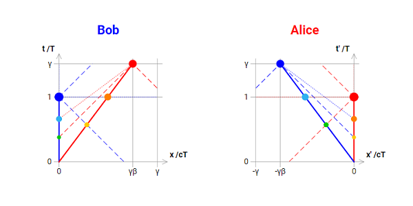

# SpecialRelativity: Inertial frames

InertialFrames version 1.0.0-alpha  
STUDY.Physics.SpecialRelativity/InertialFrames  
Physics case studies: Special Relativity: Inertial Frames

Copyright (C) 2020 Julio P. Di Egidio (http://julio.diegidio.name)  
InertialFrames is part of the STUDY.Physics.SpecialRelativity collection  
(see https://github.com/jp-diegidio/STUDY.Physics.SpecialRelativity).  
InertialFrames is released under the terms of the GNU-GPLv3 license.  
As usual, NO WARRANTY OF ANY KIND is implied.

- [Go to interactive demo page](https://jp-diegidio.github.io/STUDY.Physics.SpecialRelativity/InertialFrames/App/index.html)
- [Go back to project home page](https://github.com/jp-diegidio/STUDY.Physics.SpecialRelativity)

## The game

Bob and Alice pass by each other collinearly at a relative constant speed.  
They reset their clocks to zero at the moment they are colocated.

  
For an interactive version of the diagrams see [Project demo page]

From the space-time diagrams we can readily see that, while each of Bob's and
Alice's clock keeps marking the one and only universal (aka proper) time, in
their own frames each has the other moving away faster in the future, as well
as faster in space than the plain frame speed, exactly by a factor of gamma.

Incidentally, this shows how inertial relative motion already has the elements
of *time travel*.  But notice that there is no paradox here, the situation is
perfectly symmetrical as expected: the so called Twin Paradox rather ensues
because Alice inverts her motion at some point and comes back to base, which
is *not* symmetrical.

Below we show derivations of the temporal and spatial coordinates and
velocities of "particles" B and A (for Bob and Alice, respectively), and of the
corresponding "projected particles".  We parametrise all formulas, besides on
the relative (frame!) speed, on the (one!) proper time.

## Formal setup

In SR in 1+1 dimensions, with c = 1, and  
generic coordinates of the form P = (tP, xP), and  
generic velocities of the form vP = (v_tP, v_xP).

```
Given PARAMETER b (for "beta") a speed         in [0, 1] sub Reals:

Let g (for "gamma") be 1/sqrt[1 - b^2]         in [1, g] sub Reals.
    // (i.e. in [1, oo], but we will keep gamma throughout as a scale factor)

For PARAMETER t (for "tau") the proper time    in [0, 1] sub Reals:
```

(Notice that we keep track of the domains of definition of the various
quantities just in order to help eventually render the two frames as finite
diagrams: this has no relevance on the physics.  Also notice that we use a
somewhat simplified notation, most notably t instead of tau, because only ASCII
characters are allowed here and in code.)

## FRAME B

This is the frame of reference in which Bob is at rest at the origin of space.

We derive coordinates (and then velocities) in this frame by imposing the
relevant physical constraints, then by plain geometry.

### Particle B

This are Bob's *actual* space-time location (in frame B).

We derive the coordinates from the constraint that Bob is at rest at the origin
of space, hence xB = 0, then imposing the constraint that Bob's proper distance
from the origin of space-time is t (i.e. "tau"), hence t = sqrt\[tB^2 - xB^2\] =
tB, hence tB = t:

```
 B = (t, 0)
vB = (1, 0)

with the coordinates as derived above being:
  tB(t) = t    in [0, 1]
  xB(t) = 0    in [0, 0]

and, by taking derivatives of the coordinates w.r.t. t, the velocities being:
  v_tB(t) = d(tB(t))/dt = 1
  v_xB(t) = d(tB(t))/dt = 0
```

### Particle A

This is Alice's *actual* space-time location.

We derive the coordinates from the constraint that Alice's (frame) velocity is
b, hence xA = b\*tA, then imposing the constraint that Alice's proper distance
from the origin of space-time too is t (i.e. tau), hence t = sqrt\[tA^2 - xA^2\]
= sqrt\[tA^2\*(1 - b^2)\] = tA/g, hence tA = gt and xA = gbt:

```
 A = (gt, gbt)
vA = (g,  gb)

with the coordinates as derived above being:
  tA(t) = gt    in [0, g]
  xA(t) = gbt   in [0, g]

and, by taking derivatives w.r.t. t, the velocities being:
  v_tA(t) = d(tA(t))/dt = g
  v_xA(t) = d(tA(t))/dt = gb
```

### Particle A_sim

This is the (moving) point of intersection of Alice's world line with Bob's line
of simultaneity.  It represents what Bob can measure about Alice in his own
plane of simultaneity, e.g. here he finds length contraction and time dilation.

We derive A_sim's coordinates by intersecting A's world line, i.e. X = bT,
with B's line of simultaneity, i.e. T = t (with X,T formal parameters), hence
T = t and X = bt, whence tA_sim and xA_sim.

We also notice that, all relations being linear, the ratio of A_sim's proper
distance (from the origin of space-time) to A's proper distance must be the same
as the ratio of A_sim's time coordinate to A's time coordinate.  A_sim's proper
distance is t' = sqrt\[tA_sim^2 - xA_sim^2\] = sqrt\[t^2*(1 - b^2)\] = t/g (with
t' again just a formal parameter), while A's proper distance is given as t,
hence we get t' = t/g.  So below we rather compute A_sim's coordinates by
applying Alice's *actual* coordinates to this "rescaled proper time" (and, of
course, we get the same result as above).

```
 A_sim = (t, bt)
vA_sim = (1, b)

with the coordinates being:
  tA_sim(t) = tA(t/g) = t    in [0, 1]
  xA_sim(t) = xA(t/g) = bt   in [0, 1]

and the velocities being:
  v_tA_sim(t) = d(tA_sim(t))/dt = 1
  v_xA_sim(t) = d(tA_sim(t))/dt = b
```

### Particle B_sim

This is the (moving) point of intersection of Bob's world line with Alice's line
of simultaneity.  It represents what Bob can measure about Alice in his own
plane of simultaneity, e.g. here he finds length contraction and time dilation.

We derive B_sim's coordinates by intersecting B's world line, i.e. X = 0, with
A's line of simultaneity, i.e. (T-tA) = b\*(X-xA) <=> (T-gt) = b\*(X-gbt), hence
X = 0 and T = gt(1-b^2) = t/g, whence tB_sim and xB_sim.

Now, doing as above, B_sim's proper distance is t' = sqrt\[tB_sim^2 - xB_sim^2\]
= sqrt\[(t/g)^2\] = t/g , while B's proper distance is given as t, hence we get
t' = t/g.  So below we rather compute B_sim's coordinates by applying Bob's
*actual* coordinates to this "rescaled proper time".

```
 B_sim = (t/g, 0)
vB_sim = (1/g, 0)

with the coordinates being:
  tB_sim(t) = tB(t/g) = t/g   in [0, 1/g]
  xB_sim(t) = xB(t/g) = 0     in [0, 0]

and the velocities being:
  v_tB_sim(t) = d(tB_sim(t))/dt = 1/g
  v_xB_sim(t) = d(tB_sim(t))/dt = 0
```

### Particle A_app

This is the (moving) point of intersection of Alice's world line with Bob's past
light cone.  It represents what Bob can *see* by looking in Alice's direction.

We derive A_app's coordinates by intersecting A's world line, i.e. X = bT,
with B's past light cone, i.e. T = t-X, hence T = t/(1+b) and X = bt/(1+b),
whence tA_app and xA_app.

Now, doing as above, A_app's proper distance is t' = sqrt\[tA_app^2 - xA_app^2\]
= sqrt\[(t/(1+b))^2 - (bt/(1+b))^2\] = sqrt\[t^2(1 - b^2)\]/(1+b) = t/(g(1+b)),
while A's proper distance is given as t, hence we get t' = t/(g(1+b)).  So below
we rather compute A_app's coordinates by applying Alice's *actual* coordinates
to this "rescaled proper time".

```
 A_app = (t/(1+b), bt/(1+b))
vA_app = (1/(1+b), b/(1+b))

with the coordinates being:
  tA_app(t) = tA(t/(g(1+b))) = t/(1+b)    in [0, 1]
  xA_app(t) = xA(t/(g(1+b))) = bt/(1+b)   in [0, 1/2]

and the velocities being:
  v_tA_app(t) = d(tA_app(t))/dt = 1/(1+b)
  v_xA_app(t) = d(tA_app(t))/dt = b/(1+b)
```

### Particle B_app

This is the (moving) point of intersection of Bob's world line with Alice's past
light cone.  It represents what Alice can *see* by looking in Bob's direction.

We derive B_app's coordinates by intersecting B's world line, i.e. X = 0, with
A's past light cone, i.e. (T-tA) = (X-xA) <=> (T-gt) = (X-gbt), hence
T = g(1-b)t = t/(g(1+b)) and X = 0, whence tB_app and xB_app.

Now, doing as above, B_app's proper distance is t' = sqrt\[tB_app^2 - xB_app^2\]
= sqrt\[(t/(g(1+b)))^2\] = t/(g(1+b)), while B's proper distance is given as t,
hence we get t' = t/(g(1+b)).  So below we rather compute B_app's coordinates by
applying Bob's *actual* coordinates to this "rescaled proper time".

```
 B_app = (t/(g(1+b)), 0)
vB_app = (1/(g(1+b)),  0)

with the coordinates being:
  tB_app(t) = tB(t/(g(1+b))) = t/(g(1+b))   in [0, 1]
  xB_app(t) = xB(t/(g(1+b))) = 0            in [0, 0]

and the velocities being:
  v_tB_app(t) = d(tB_app(t))/dt = 1/(g(1+b))
  v_xB_app(t) = d(tB_app(t))/dt = 0
```

## Diagram boundaries

As can be extrapolated from above, coordinate boundaries for frame B are:

```
  t in [0, g]
  x in [0, g]
```

We can then draw a finite diagram by scaling down in both directions by a
factor of gamma.

##  FRAME A

This is the frame of reference in which Alice is at rest at the origin of space.

We obtain coordinates in this frame by Lorentz-transforming by velocity b the
corresponding coordinates in frame B.  In fact, this is only to double-check the
mathematical correctness of our previous derivations, the expected resulting
diagram being perfectly symmetrical to the one found for frame B, so we could
more efficiently obtain the coordinates (and indeed we do, in code!) by just
swapping the roles of (particles) B and A and inverting the sign of the space
coordinates in all places.

### Particle A'

Given that A = (gt, gbt):

```
  tA'(t) = g(tA - b*xA) = g(gt - g(b^2)t) = t   in [0, 1]
  xA'(t) = g(xA - b*tA) = g(gbt - gbt) = 0      in [0, 0]
```

(Symmetrical to particle B in frame B as expected.)

### Particle B'

Given that B = (t, 0):

```
  tB'(t) = g(tB - b*xB) = g(t - 0) = gt      in [0, g]
  xB'(t) = g(xB - b*tB) = g(0 - bt) = -gbt   in [0, -g]
```

(Symmetrical to particle A in frame B as expected.)

### Particle B_sim'

Given that B_sim = (t/g, 0):

```
  tB_sim'(t) = g(tB_sim - b*xB_sim) = g(t/g - b*0) = t     in [0, 1]
  xB_sim'(t) = g(xB_sim - b*tB_sim) = g(0 - b*t/g) = -bt   in [0, -1]
```

(Symmetrical to particle A_sim in frame B as expected.)

### Particle A_sim'

Given that A_sim = (t, bt):

```
  tA_sim'(t) = g(tA_sim - b*xA_sim) = g(t - b*bt) = t/g   in [0, 1/g]
  xA_sim'(t) = g(xA_sim - b*tA_sim) = g(bt - b*t) = 0     in [0, 0]
```

(Symmetrical to particle B_sim in frame B as expected.)

### Particle B_app'

Given that B_app = (t/(g(1+b)), 0):

```
  tB_app'(t) = g(tB_app - b*xB_app) = g(t/(g(1+b)) - b*0) = t/(1+b)     in [0, 1]
  xB_app'(t) = g(xB_app - b*tB_app) = g(0 - b*t/(g(1+b))) = -bt/(1+b)   in [0, -1/2]
```

(Symmetrical to particle A_app in frame B as expected.)

### Particle A_app'

Given that A_app = (t/(1+b), bt/(1+b)):

```
  tA_app'(t) = g(tA_app - b*xA_app) = g(t/(1+b) - b*bt/(1+b)) = t/(g(1+b))   in [0, 1]
  xA_app'(t) = g(xA_app - b*tA_app) = g(bt/(1+b) - b*t/(1+b)) = 0            in [0, 0]
```

(Symmetrical to particle B_app in frame B as expected.)

## Diagram boundaries

Again, as can be extrapolated from above, but already by plain symmetry with
frame B, coordinate boundaries for frame A are:

```
  t' in [0, g]
  x' in [0, g]
```

This completes our calculations.
